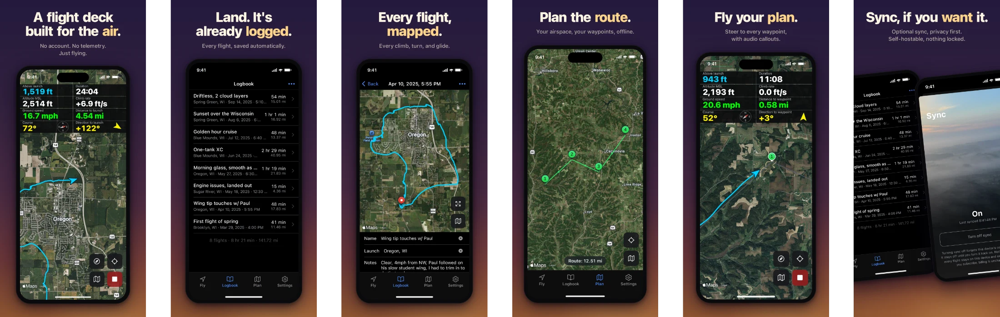

<p align="center">
  
</p>

<h1 align="center">Wingover</h1>

<p align="center">
Paramotor flight recorder
</p>

<p align="center">
  
</p>

- [STEERING.md](./STEERING.md) — project direction and values
- [PLAN.md](./PLAN.md) — current status and next steps

## Development

Most development happens in a plain browser against a mock recording engine (append `?mock-speed=120` to time-compress simulated flights).

Maps: street view (OpenFreeMap) works with zero configuration. The satellite layer uses MapTiler — the built-in key is restricted to official builds (origin `wingover.app` / app user agent), so for your own satellite builds get a free key at maptiler.com and set `VITE_MAPTILER_KEY` (or paste it under Settings → MapTiler key).

```sh
pnpm install
pnpm dev        # browser ring with mock engine
pnpm test       # unit tests
pnpm e2e        # Playwright e2e, including reload kill drills
pnpm build      # typecheck + production build
```

Sync is developed against a real CouchDB, with no Apple developer account, no
StoreKit and no Mac — only the credential is faked:

```sh
docker compose -f dev/couchdb/docker-compose.yml up -d
pnpm dev
```

Then Settings → Subscription → **Use my own server**:

| Server   | `http://localhost:5984` |
| -------- | ----------------------- |
| Database | `dev-db`                |
| Username | `dev-user`              |
| Password | `dev-pw`                |

That account is provisioned on demand, with the real `validate_doc_update` that
is the paywall. A second browser profile is a second device. For a lapsed
(read-only) account, ask for one:

```sh
curl -XPOST localhost:5173/v1/session -H 'content-type: application/json' \
  -d '{"fake":true,"account":"lapsed","entitled":false}'   # -> lapsed-db/-user/-pw
```

## Syncing to your own CouchDB

Settings → Subscription → **Use my own server**. Wingover talks to CouchDB
directly and never to anything else, so CouchDB has to allow the app's origin —
a stock install ships with CORS **off**, and without this the app cannot reach
your server at all:

```ini
[chttpd]
enable_cors = true

[cors]
credentials = true
; the origin you serve Wingover from; tauri://localhost is the iOS app
origins = https://wingover.app, tauri://localhost
headers = accept, authorization, content-type, origin, referer
methods = GET, PUT, POST, HEAD, DELETE
```

You need a database and a user who can read and write it. Nothing else — no
design documents, no schema. Wingover puts flights in whatever database you
name, and a lapsed subscription is somebody else's problem on a server you own.

## License

[AGPL-3.0](./LICENSE)
